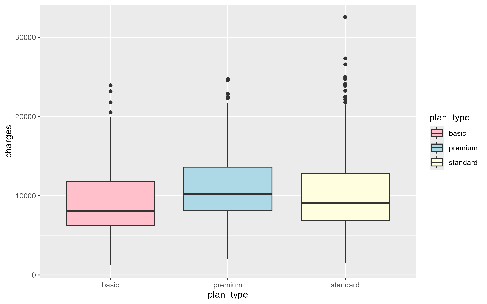
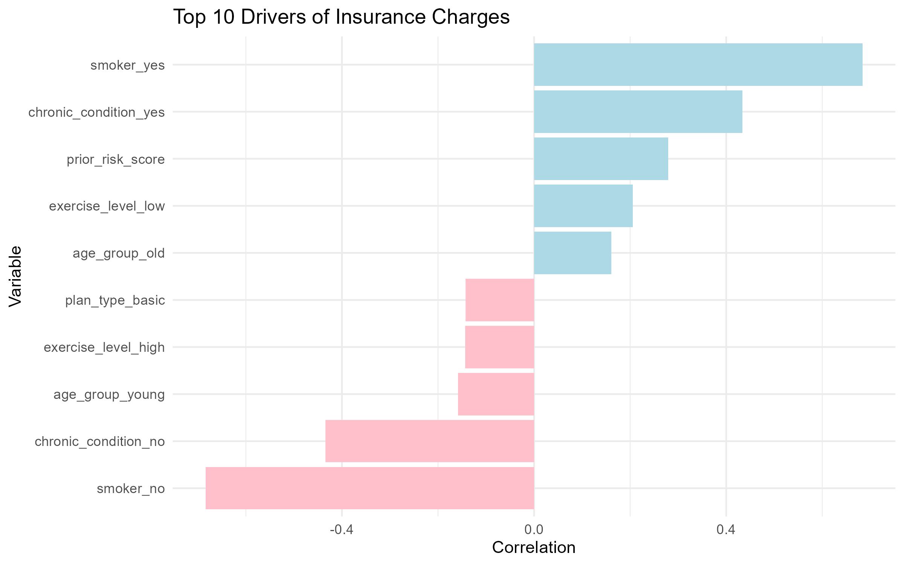
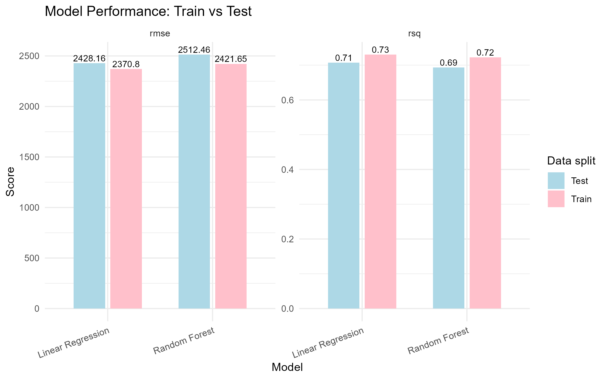
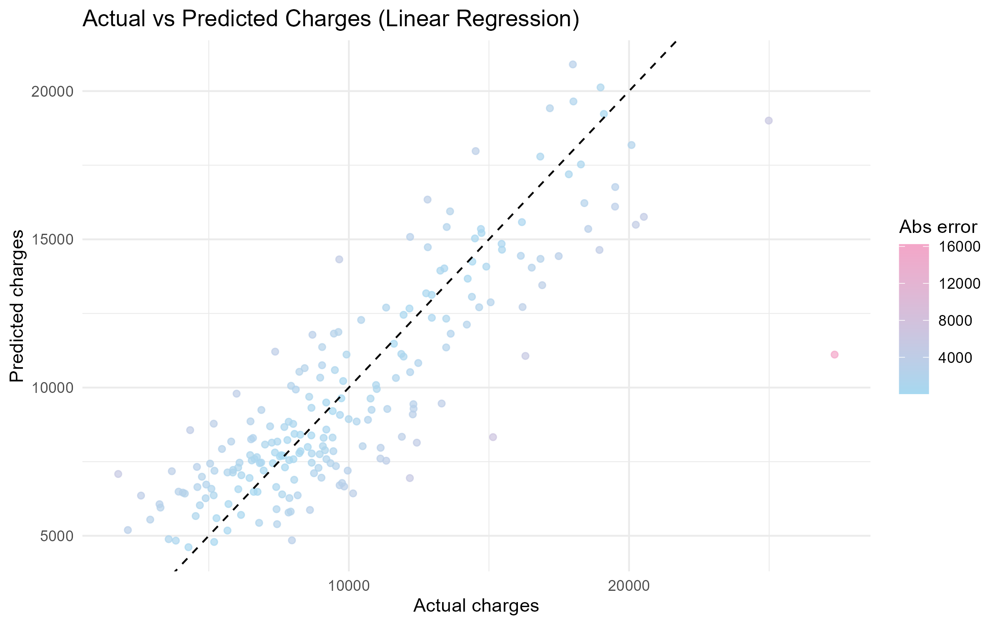
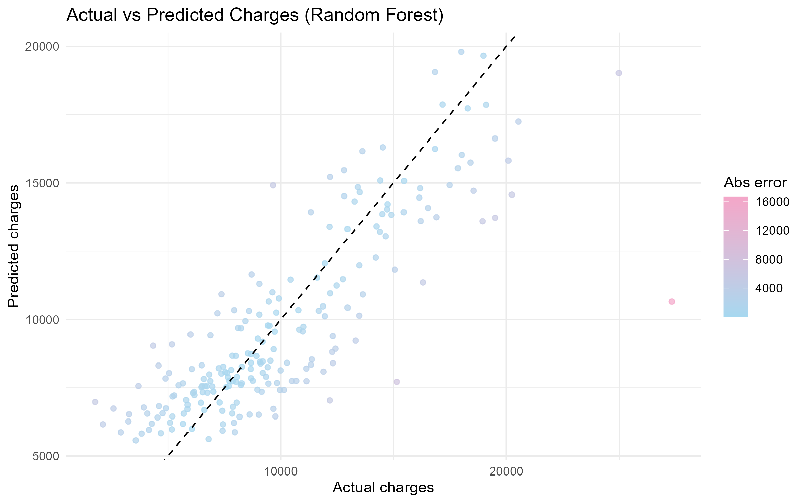

```{r setup, include=FALSE}
library(shiny)
library(dplyr)
library(ggplot2)
library(readr)

df_insurance <- read_csv("df_insurance.csv")
top_10_error_lm <- read_csv("top_10_error_lm.csv")
top_10_error_rf <- read_csv("top_10_error_rf.csv")
```

## Syfte

Målet är att analysera ett dataset med kundinformation för att identifiera vilka faktorer som har störst påverkan på försäkringskostnader. Genom explorativ dataanalys ska samband i datat kartläggas och viktiga variabler lyftas fram.

Vidare syftar övningen till att utveckla och utvärdera en regressionsmodell i R, med fokus på att förstå hur väl modellen kan förklara variationer i kostnader. Resultaten ska tolkas i ett affärssammanhang för att bedöma om modellen kan fungera som ett stöd vid framtida prissättning.

------------------------------------------------------------------------

## Metod

Inledningsvis utvecklades skript för att ladda in och förbereda datat. Detta inkluderade att identifiera och hantera inkonsekvenser samt saknade värden. Variablernas datatyper granskades och justerades vid behov för att säkerställa att de var korrekt formaterade, vilket skapade förutsättningar för mer tillförlitliga och meningsfulla analyser i efterföljande steg.

För analysen användes en applikation utvecklad i Shiny för att undersöka sambandet mellan varje enskild variabel och försäkringskostnaderna. Resultaten från denna explorativa analys låg till grund för urvalet av relevanta variabler som senare inkluderades i modelleringen.

Vid modelleringen tillämpades både linjär regression och Random Forest för att utvärdera hur väl kostnaderna kan prediceras baserat på de utvalda variablerna. Syftet var att jämföra modellernas prediktiva förmåga och få en bredare förståelse för datats struktur.

Efter genomförd träning och testning genomfördes en felanalys för att identifiera systematiska avvikelser i modellernas prediktioner samt för att upptäcka eventuella outliers i det ursprungliga datasetet. Denna analys bidrar till en fördjupad förståelse av modellernas begränsningar och ger vägledning för hur resultaten bör tolkas och användas i framtida tillämpningar.

------------------------------------------------------------------------

## Resultat

### Korrelation mellan variabler och försäkringskostnader

Det ursprungliga datasetet innehåller information om cirka 1100 kunder, där 13 olika variabler har samlats in för varje individ. Vissa kunder har saknade värden: 28 för BMI, 22 för träningsnivå och 20 för antal årliga hälsokontroller.

Vi väljer att ta bort kunder som saknar information om BMI och träningsnivå, eftersom dessa variabler ger viktig information som kan påverka kostnaderna.

Däremot behåller vi kunder som saknar information om antal årliga hälsokontroller och ersätter dessa värden med det mest frekventa värdet. Detta eftersom variabeln bedöms vara mindre viktig, vilket gör att vi kan behålla fler observationer i datasetet för modellering.

Vid analys av kostnader per försäkringstyp kan vi se att datamängden innehåller flera outliers inom standardförsäkringen, och särskilt en extrem outlier.



Vid analys av både numeriska och kategoriska variabler framkommer att ålder, tidigare olyckor, rökstatus, kroniska sjukdomar samt fysisk aktivitetsnivå har störst påverkan på försäkringskostnaderna.

```{r}
numeric_vars <- df_insurance %>%
  select(where(is.numeric)) %>%
  select(-charges) %>%
  names()

categorical_vars <- df_insurance %>%
  select(where(~ is.character(.) || is.factor(.))) %>%
  select(-customer_id) %>%
  names()
```

## Variables VS charges Dashboard

::: tabset
### Numeric Features

```{r}
sidebarLayout(
  sidebarPanel(
    selectInput(
      "num_var",
      "Select numeric variable:",
      choices = numeric_vars,
      selected = "age"
    )
  ),
  
  mainPanel(
    h3("Average Charges + Trendline"),
    plotOutput("num_plot")
  )
)
```

### Categorical Features

```{r}
sidebarLayout(
  sidebarPanel(
    selectInput(
      "cat_var",
      "Select categorical variable:",
      choices = categorical_vars,
      selected = categorical_vars[1]
    )
  ),
  
  mainPanel(
    h3("Average Charges by Category"),
    plotOutput("cat_plot")
  )
)
```
:::

```{r context="server"}
output$num_summary <- renderPrint({
  summary(df_insurance[[input$num_var]])
})

output$num_plot <- renderPlot({
  
  x <- df_insurance[[input$num_var]]
  
  breaks <- seq(
    floor(min(x, na.rm = TRUE)),
    ceiling(max(x, na.rm = TRUE)),
    by = 1
  )
  
  df_plot <- df_insurance %>%
    mutate(bin = cut(.data[[input$num_var]],
                     breaks = breaks,
                     include.lowest = TRUE)) %>%
    group_by(bin) %>%
    summarise(avg_charges = mean(charges, na.rm = TRUE), .groups = "drop")
  
  ggplot(df_plot, aes(x = bin, y = avg_charges, group = 1)) +
    geom_col(fill = "lightblue") +
    geom_smooth(method = "lm", se = FALSE, color = "pink") +
    theme_minimal() +
    labs(x = input$num_var, y = "Average Charges") +
    theme(axis.text.x = element_text(angle = 45, hjust = 1))
})

output$cat_summary <- renderPrint({
  summary(df_insurance[[input$cat_var]])
})

output$cat_plot <- renderPlot({
  
  df_plot <- df_insurance %>%
    group_by(.data[[input$cat_var]]) %>%
    summarise(
      avg_charges = mean(charges, na.rm = TRUE),
      count = n(),
      .groups = "drop"
    )
  
  if (input$cat_var == "exercise_level") {
    df_plot[[input$cat_var]] <- factor(
      df_plot[[input$cat_var]],
      levels = c("low", "medium", "high"),
      ordered = TRUE
    )
  }
  
  ggplot(df_plot, aes(x = .data[[input$cat_var]], y = avg_charges)) +
    geom_col(fill = "lightblue") +
    geom_line(aes(group = 1), color = "pink") +
    theme_minimal() +
    labs(x = input$cat_var, y = "Average Charges") +
    theme(axis.text.x = element_text(angle = 45, hjust = 1))
})
```

Som förberedelse inför nästa steg i regressionsanalysen har nya variabler skapats i form av åldersgrupper samt en sammanslagen variabel för tidigare skadehistorik, där olyckor ges större vikt än anspråk.

Samtidigt kommer variabler utan tydlig koppling till kostnaderna (såsom kön, antal barn, region, kund-ID och försäkringstyp) att exkluderas för att förenkla modellen och förbättra dess tolkningsbarhet.



------------------------------------------------------------------------

### Regressionsanalys

Vi har valt att använda två modeller, Random Forest och linjär regression, för att träna och utvärdera deras förmåga att förutsäga försäkringskostnader (charges) baserat på de viktigaste variablerna som identifierades i föregående steg: BMI, rökstatus, kronisk sjukdom, träningsnivå, antal hälsokontroller, åldersgrupp och tidigare riskpoäng.

Datamängden har delats upp i 80 % träningsdata och 20 % testdata. Modellerna har tränats med hjälp av 5-folds Cross Validation för att säkerställa en stabil och tillförlitlig utvärdering av deras prestanda.



Resultaten visar att **linjär regression** presterar något bättre än **Random Forest** på testdatan. Detta syns genom att linjär regression har ett lägre RMSE-värde (2428 jämfört med 2512), vilket innebär att modellens prediktioner i genomsnitt ligger närmare de faktiska värdena. Samtidigt har linjär regression ett något högre R²-värde (0,707 jämfört med 0,693), vilket indikerar att den förklarar en större andel av variationen i datan.

Skillnaderna mellan modellerna är dock relativt små, vilket tyder på att båda modellerna presterar på en liknande nivå. Trots att Random Forest är en mer komplex modell, verkar den i detta fall inte ge någon tydlig förbättring jämfört med den enklare linjära modellen. Detta kan tyda på att sambanden i datan till stor del är linjära eller att datasetet inte är tillräckligt stort/komplext för att dra full nytta av en mer avancerad modell.

Sammanfattningsvis framstår linjär regression som det något bättre och mer effektiva valet i detta fall

------------------------------------------------------------------------

### Residual anaylsen

Här är din mening översatt och förbättrad till svenska:

För att förbättra modellernas prediktioner av försäkringskostnader (charges) har vi analyserat residualerna samt de största prediktionsfelen (de värsta prediktionerna).





Resultaten visar att både Random Forest- och den linjära modellen ger relativt liknande prediktioner, men att felvariationerna skiljer sig något mellan modellerna. Random Forest har i vissa fall mycket små residualer (nära noll), vilket tyder på att modellen kan träffa enskilda observationer mycket väl. Samtidigt förekommer även större avvikelser, vilket visar att modellen inte är konsekvent bättre i alla fall.

Den linjära modellen uppvisar något mer jämna fel (residualer), men kan samtidigt ha större avvikelser för vissa observationer. Detta tyder på att den är mer stabil men mindre flexibel än Random Forest.

Sammantaget bekräftar detta att skillnaderna mellan modellerna är relativt små: Random Forest kan fånga vissa komplexa mönster bättre, medan linjär regression ger mer konsekventa och stabila prediktioner över hela datamängden.

```{r}
#| echo: false

print(top_10_error_lm)

```

Här är en kort och tydlig tolkning:

Den linjära modellen missar främst extrema eller komplexa fall, där kostnaderna är ovanligt höga eller låga. I tabellen syns att modellen ofta underskattar höga kostnader (stora positiva residualer) och ibland överskattar låga kostnader. Detta tyder på att modellen inte fullt fångar icke-linjära samband eller interaktioner, särskilt för grupper som äldre personer eller individer med kroniska sjukdomar.

För att förbättra modellen kan man:

-   Lägga till interaktionstermer (t.ex. mellan ålder och kronisk sjukdom eller BMI)
-   Testa icke-linjära transformationer av variabler
-   Eller använda en mer flexibel modell, som t.ex. Random Forest eller boosting

Sammanfattningsvis saknar modellen flexibilitet för att hantera mer komplexa mönster i datan.

```{r}
#| echo: false

print(top_10_error_rf)

```

Random Forest-modellen missar också främst extrema kostnadsfall, särskilt där de faktiska kostnaderna är mycket höga. Precis som för den linjära modellen tenderar den att underskatta höga värden och ibland överskatta låga värden. Detta tyder på att modellen har svårt att fullt ut fånga de mest kostnadsdrivande faktorerna.

Trots att Random Forest är mer flexibel verkar den här sakna tillräcklig information för att förklara variationen i dessa extrema fall, exempelvis saknas viktiga variabler eller mer detaljerad riskinformation (t.ex. sjukdomsgrad eller fler hälsorelaterade faktorer).

För att förbättra modellen kan man:

-   Lägga till mer informativa variabler (t.ex. mer detaljerad hälsodata)
-   Justera modellens parametrar (hyperparameter tuning)
-   Testa mer avancerade modeller som boosting

Sammanfattningsvis är problemet mindre kopplat till modellens flexibilitet och mer till att viktig information saknas i datan.

Den mest intressanta observationen är rad 1 — en ung icke-rökare med lågt BMI (18,2), riskpoäng 0 och försäkringskostnader på 16 059. Båda modellerna missar denna observation kraftigt (ca 10–12k fel), eftersom inga av de tillgängliga variablerna förklarar utfallet. Detta är sannolikt en extrem observation med en oupptäckt drivande faktor, exempelvis ett engångsbesök, en olycka eller en diagnos som inte fångas i datamängden.

------------------------------------------------------------------------

## Sammanfattning av analysen

Syftet med projektet har varit att analysera vilka faktorer som påverkar försäkringskostnader samt att utveckla modeller som kan förutsäga dessa kostnader på ett så träffsäkert sätt som möjligt. Genom explorativ dataanalys identifierades att variabler som BMI, rökstatus, kroniska sjukdomar, ålder och tidigare riskpoäng har störst påverkan på kostnaderna.

Datasetet innehöll vissa saknade värden och outliers som hanterades genom en kombination av borttagning och imputering, beroende på variabelns betydelse för kostnaden. Detta gjorde det möjligt att behålla en så stor och relevant datamängd som möjligt samtidigt som datakvaliteten förbättrades.

Två regressionsmodeller, linjär regression och Random Forest, tränades och utvärderades med 5-fold cross validation. Resultaten visade att modellerna presterar på en relativt lik nivå, där linjär regression marginellt överträffade Random Forest i både RMSE och R². Detta tyder på att sambanden i datan till stor del är linjära, men också att vissa mer komplexa mönster förekommer.

Residualanalysen visade att båda modellerna har störst svårigheter med extrema observationer, där kostnaderna är mycket höga eller mycket låga. Detta indikerar att viktiga förklarande faktorer saknas i datan eller att relationerna mellan variablerna är mer komplexa än vad modellerna fullt fångar. Särskilt rökstatus, ålder och sjukdomsstatus är starka drivande faktorer, men förklarar inte alla avvikelser.

## Nästa steg för att nå målet

För att förbättra modellernas träffsäkerhet och komma närmare en användbar modell för prissättning bör följande steg genomföras:

1. Förbättra feature engineering
-    Skapa fler interaktioner (t.ex. ålder × kronisk sjukdom, BMI × rökning)
-    Testa icke-linjära transformationer av viktiga variabler
-    Förfina riskvariabeln ytterligare (mer detaljerad riskprofil)

2. Hantera extremvärden mer systematiskt
-    Separat analys av outliers (t.ex. segmentmodellering)
-    Log-transformera target (charges) för att minska skevhet
-    Testa robusta modeller som är mindre känsliga för extrema värden

3. Modellutveckling
-    Hyperparameter-tuning för Random Forest
-    Testa mer avancerade modeller som Gradient Boosting (t.ex. XGBoost eller LightGBM)
-    Jämföra med regulariserade modeller (Ridge/Lasso)

4. Databearbetning och databerikning
-    Undersöka om viktiga förklarande variabler saknas (t.ex. allvarlighetsgrad av sjukdom, antal diagnoser)
-    Försöka komplettera datasetet med mer granular hälsodata .
 
 
 ------------------------------------------------------------------------

## Självreflektion

Jag tycker att jag gjorde ett bra arbete med att strukturera analysen och förbättra läsbarheten genom att använda nya funktioner. Jag har uppfyllt kraven genom att analysera datat, använda visualiseringar och bygga samt tolka regressionsmodeller.

Det svåraste var att jämföra olika modeller och motivera valen på ett fördjupat sätt.

Jag anser att min inlämning motsvarar VG, eftersom jag har uppfyllt alla grundkrav och även gjort en mer utvecklad analys med modelljämförelser och reflektion kring styrkor och svagheter.
